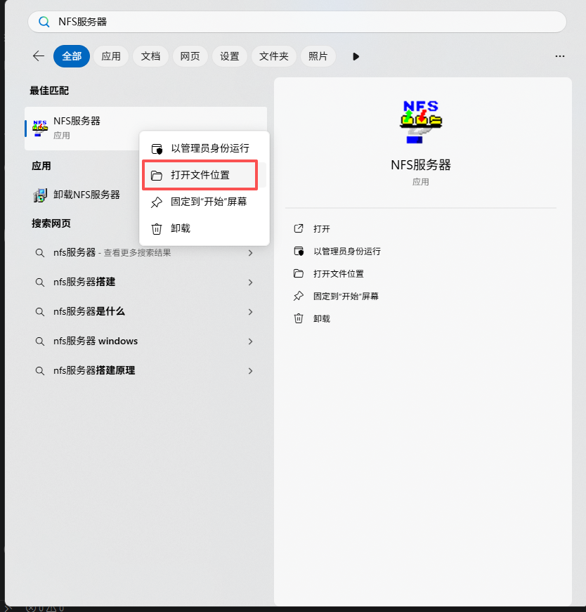
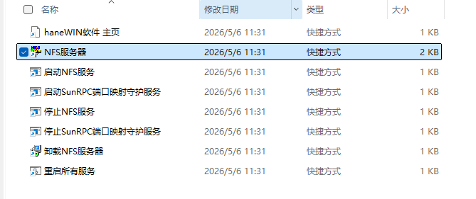
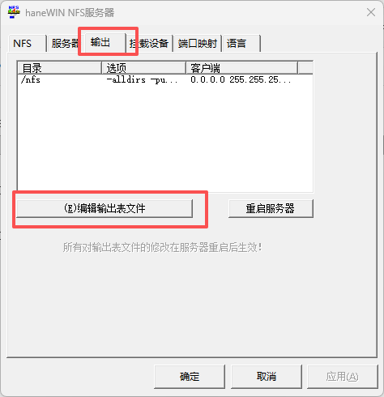
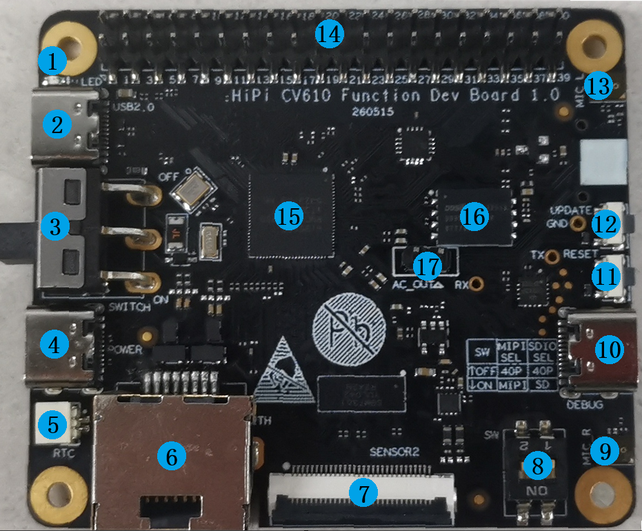
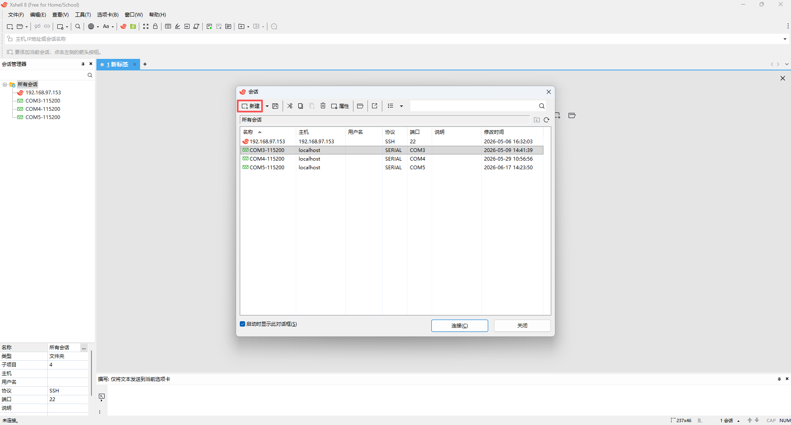
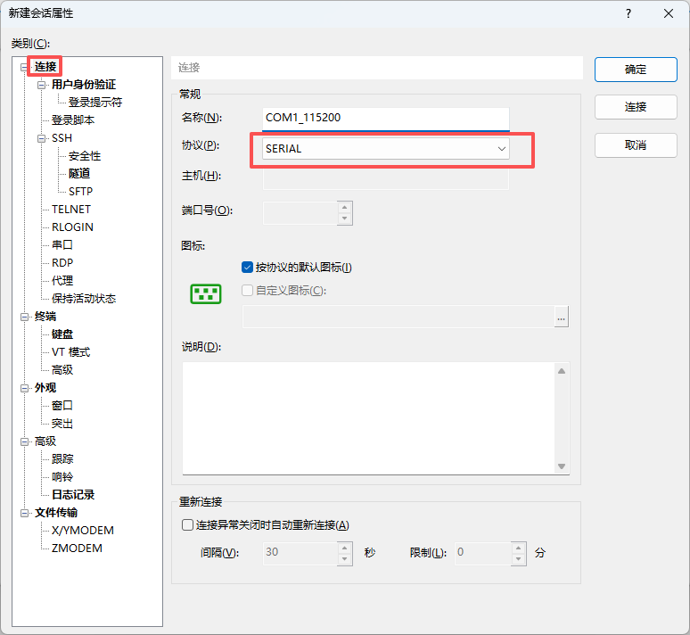
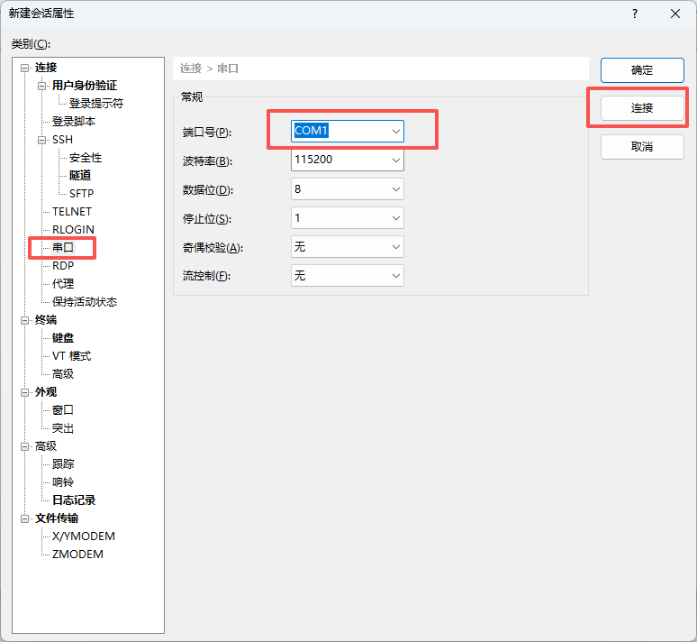
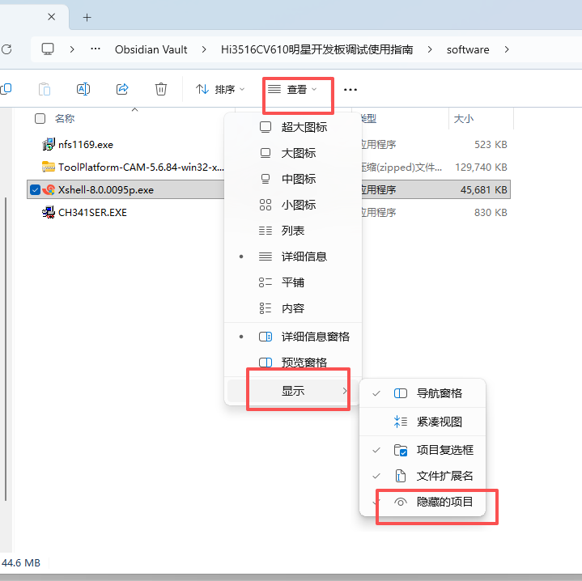

# Hi3516CV610开发板调试使用指南

## 1. 调试环境准备

### 1.1. NFS服务器
注意，需要关闭防火墙。

1. 新建共享目录，例如：在`D盘`新建目录，名为`nfs`。

2. 安装NFS服务器。安装包在[./software/nfs1169.exe](./software/nfs1169.exe)

> **建议安装在非C盘。** 其余选择默认配置即可。


3. 安装后，按下`win + S`键，搜索`NFS服务器`，鼠标右键点击`NFS服务器`，选择`打开文件所在位置`。如下图所示：

打开后如下图：


4. 右键`NFS服务器`选择`以管理员身份运行`，打开后选择`输出`，点击`编辑输出表文件`。如下图：


5. 在打开的`exports`文件中，删除所有原有内容，输入以下内容：
```
D:\nfs -public -alldirs -name:nfs -range 0.0.0.0 255.255.255.255
```
> 其中，`D:\nfs`是第1步所创建的目录。

6. 按下`CTRL + S`保存后，关闭`exports`文件。在`NFS服务器`中，点击`确定`来关闭`NFS服务器`。

7. 在第3步打开的目录中，鼠标右键点击`重启所有服务`，选择`以管理员身份运行`。

8. 等待重启完毕，NFS服务器即配置成功。

### 1.2. 串口驱动

安装包所在位置：[./software/CH341SER.EXE](./software/CH341SER.EXE)

双击打开后，点击安装即可。

### 1.3. Xshell串口工具

安装包所在位置：[./software/Xshell-8.0.0095p.exe](./software/Xshell-8.0.0095p.exe)

双击打开后安装即可，无多余要求。

### 1.4. 烧录工具

软件压缩包所在位置：[./software/ToolPlatform-CAM-5.6.84-win32-x86_64.zip](./software/ToolPlatform-CAM-5.6.84-win32-x86_64.zip)

解压后即可使用。


## 2. 开发板接线

如图所示：


重点关注以下表中的`3,4,6,10,9,13`即可。

4 接 `5V3A` 电源。

10 接 调试用的电脑。

6 接 网线，与调试电脑在同一局域网下，或者与调试电脑直连。

13,9 分别是左右声道。

3 是电源开关。

|接口编号|位号|描述|
|:---:|:---:|:-----|
|1|D502|电源指示灯，红色，通电即亮|
|2|J1319|Hi3516CV610的USB2.0通讯接口，同时可做单板电源5V输入口|
|3|SW1303|电源开关，向上是断电，向下是通电|
|4|J17|电源输入口，5V/3A|
|5|J1317|RTC电池输入口，极性上负下正|
|6|RJ1|10M/100M以太网口，用于软件烧录升级|
|7|J6|Sensor2接口MIPI为2Lane，FPC座30PIN,0.5mm脚距,下接触,MIPI为2Lane|
|8|SW1301|拨码开关，MIPI、SDIO接口与40PIN排针切换开关|
|9|U1416|模拟硅麦，右声道|
|10|J1318|USB转Debug Uart接口，转换芯片:CH343P|
|11|SW1302|轻触按键，Reset功能，<span style="color: red;">长按3秒后重启</span>|
|12|SW2|轻触按键，更新固件时按住后再通电|
|13|U1415|模拟硅麦，左声道|
|14|J3|40PIN 排针，Hi3516的可用GPIO|
|15|U1|SOC Hi3516CRNCV610-20S 单核 主频950M 内置DDR3大小128MB|
|16|U909|Flash 默认SPI Nand 256MB，可支持SPI NOR 32MB|
|17|J21|音频回采接口|
|18|J1211|TF卡槽，可接TF卡（最大容量：TBD）或EMMC卡（最大容量：TBD）|
|19|J47|喇叭接口，默认接8Ω/2W喇叭|
|20|J47|Sensor1接口，FPC座30PIN,0.5mm脚距,下接触，MIPI默认2Lane，可切换成4Lane|

## 3. 使用串口工具连接开发板并进入系统

1. 按照第1章准备调试环境，照第2章正确连线。

2. 按下`win + S`键，搜索并打开`设备管理器`，插拔开发板串口线，观察到出现并消失的`COM`口，即为开发板端口号。

3. 按下`win + S`键，搜索并打开`Xshell`。

4. 在弹出的窗口中，选择`新建`，如下图所示：


5. 根据开发板实际对应的端口号，填入名称(无硬性要求)。`协议`选择`SERIAL`。如下图所示：


6. 点击左侧的`串口`，在`端口号`中选择开发板实际对应的端口号。点击`连接`。如下图所示：


7. 此时给开发板上电，即可看到相应的启动日志，观察到绿色的`Welcome Linux`类似日志后，即可自由输入命令。

## 4 NFS挂载

开机后，海思demo会自动启动，启动时会运行udhcpc来尝试获取ip。如果开发板接入的局域网内有`开启了DHCP功能的路由器`，则会正常获取到能上网的IP，否则会获取不到IP，无法上网。

也可以手动运行`udhcpc -i eth0`的命令来尝试获取IP。

如果无`开启了DHCP功能的路由器`，则需要手动配置IP。

需要先查看你电脑的IP与子网掩码，然后在开发板中用`ifconfig`命令来设置IP，开发板IP的网段、子网掩码需要和你电脑的相同。例如：

```
你电脑IP和子网掩码：
192.168.1.100
255.255.255.0

则需要输入下面命令来设置开发板的IP，注意IP不要和别的设备冲突：
ifconfig eth0 192.168.1.101 netmask 255.255.255.0
```

配置好开发板IP后，可以参考下面来把电脑的共享目录挂载到板端：

```
例如你电脑IP为：
192.168.1.100

在开发板输入下面命令：
mount -t nfs -o nolock,addr=192.168.1.100 192.168.1.100:/nfs /mnt
```

挂载成功后，在板端的`/mnt/`目录下新建文件或目录，在电脑的`D:\nfs\`目录下也可以看到对应的文件或目录。

如果看不到，可以看看下图配置打开了没有：


## 5 海思demo

海思demo会在开发板开机后自动运行。
demo程序在板端的位置: `/app/dui_plus_realtime_recognition/dui_plus_realtime_recognition`

### 5.1 海思demo日志

#### 5.1.1 实时查看日志

输入以下命令即可实时查看日志，按下`CTRL + C`即可退出实时查看日志。

```
tail -f -n 50 /app/dui_plus_realtime_recognition/app.log
```

#### 5.1.2 设置日志等级

当前日志等级默认为`debug`。

输入以下命令即可设置日志等级，例如设置日志等级为`info`。

注意：输入命令后，程序会重启。

```
dui-set-log-level info
```

### 5.2 关闭/开启 开机自动启动海思demo

海思demo会在开发板开机后自动运行。

输入命令`vi /etc/init.d/S99dui-plus`编辑开机启动脚本。

注释掉下面一行即可关闭 `开机自动启动`。

```
    "$APP_BIN" 9>&- >>"$APP_LOG" 2>&1 &
```

### 5.3 海思demo运行时动态dump处理前后音频

建议dump前先按照`第4章`挂载。

海思demo运行后，输入下面命令即可开启实时dump音频

```
dui-dump on
```

输入下面命令停止dump音频

```
dui-dump off
```

输出路径默认为`/mnt/dui_audio_dump/`。

dump配置文件位于板端：

```text
/app/dui_plus_realtime_recognition/config/dump_config.json
```

应用只在每次关闭到开启的切换中读取一次完整配置快照。输出目录在开启时按需创建，并先校验路径和
剩余空间；dump 已开启时修改其他字段，下一次重新开启才生效。文件 I/O 全部由 dump 线程执行。

当前输出文件为：

```text
*_raw_2ch.pcm
*_sspe_output_ch0_1ch.pcm       # 融合 BEFORMING 单声道输出，保留兼容文件名
*_sspe_asr_audio_1ch.pcm        # SDK 提供额外 ASR 音频时写入
*_sspe_wkp_audio_ch0_1ch.pcm    # 兼容占位，融合链路通常无该单项回调
```

如果已经按照`第4章`挂载了，在电脑的`D:\nfs\`目录下可以看到创建的`dui_audio_dump`目录。